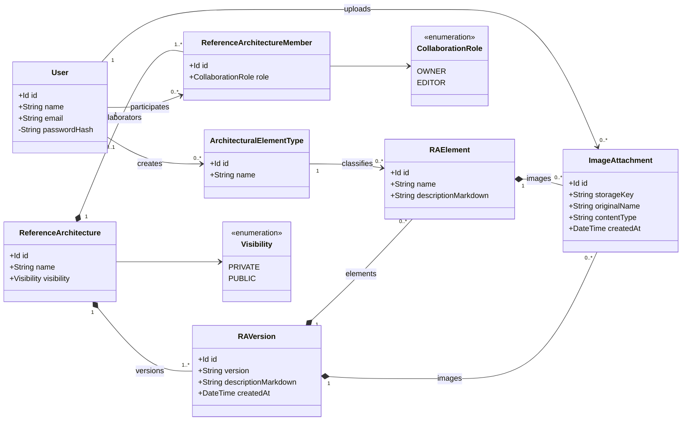

# 01-ra-colaboracao

```mermaid
classDiagram
    direction LR

    class User {
        +Id id
        +String name
        +String email
        -String passwordHash
    }

    class ReferenceArchitecture {
        +Id id
        +String name
        +Visibility visibility
    }

    class ReferenceArchitectureMember {
        +Id id
        +CollaborationRole role
    }

    class RAVersion {
        +Id id
        +String version
        +String descriptionMarkdown
        +DateTime createdAt
    }

    class RAElement {
        +Id id
        +String name
        +String descriptionMarkdown
    }

    class ArchitecturalElementType {
        +Id id
        +String name
    }

    class ImageAttachment {
        +Id id
        +String storageKey
        +String originalName
        +String contentType
        +DateTime createdAt
    }

    class CollaborationRole {
        <<enumeration>>
        OWNER
        EDITOR
    }

    class Visibility {
        <<enumeration>>
        PRIVATE
        PUBLIC
    }

    User "1" --> "0..*" ReferenceArchitectureMember : participates
    ReferenceArchitecture "1" *-- "1..*" ReferenceArchitectureMember : collaborators

    ReferenceArchitecture "1" *-- "1..*" RAVersion : versions
    RAVersion "1" *-- "0..*" RAElement : elements
    ArchitecturalElementType "1" --> "0..*" RAElement : classifies
    User "0..1" --> "0..*" ArchitecturalElementType : creates

    RAVersion "1" *-- "0..*" ImageAttachment : images
    RAElement "1" *-- "0..*" ImageAttachment : images
    User "1" --> "0..*" ImageAttachment : uploads

    ReferenceArchitectureMember --> CollaborationRole
    ReferenceArchitecture --> Visibility
```
