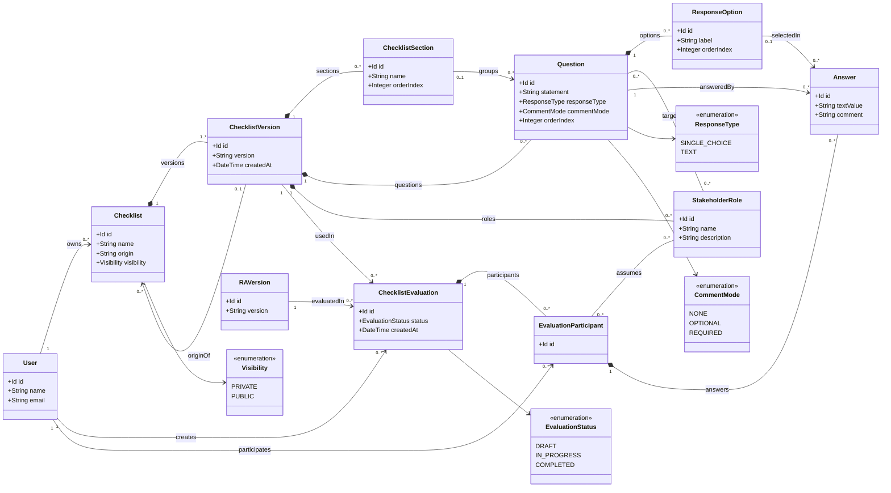

# 02-checklist-avaliacao

```mermaid
classDiagram
    direction LR

    class User {
        +Id id
        +String name
        +String email
    }

    class Checklist {
        +Id id
        +String name
        +String origin
        +Visibility visibility
    }

    class ChecklistVersion {
        +Id id
        +String version
        +DateTime createdAt
    }

    class ChecklistSection {
        +Id id
        +String name
        +Integer orderIndex
    }

    class Question {
        +Id id
        +String statement
        +ResponseType responseType
        +CommentMode commentMode
        +Integer orderIndex
    }

    class ResponseOption {
        +Id id
        +String label
        +Integer orderIndex
    }

    class StakeholderRole {
        +Id id
        +String name
        +String description
    }

    class ChecklistEvaluation {
        +Id id
        +EvaluationStatus status
        +DateTime createdAt
    }

    class EvaluationParticipant {
        +Id id
    }

    class Answer {
        +Id id
        +String textValue
        +String comment
    }

    class RAVersion {
        +Id id
        +String version
    }

    class Visibility {
        <<enumeration>>
        PRIVATE
        PUBLIC
    }

    class ResponseType {
        <<enumeration>>
        SINGLE_CHOICE
        TEXT
    }

    class CommentMode {
        <<enumeration>>
        NONE
        OPTIONAL
        REQUIRED
    }

    class EvaluationStatus {
        <<enumeration>>
        DRAFT
        IN_PROGRESS
        COMPLETED
    }

    User "1" --> "0..*" Checklist : owns
    Checklist "1" *-- "1..*" ChecklistVersion : versions
    ChecklistVersion "0..1" --> "0..*" Checklist : originOf

    ChecklistVersion "1" *-- "0..*" ChecklistSection : sections
    ChecklistVersion "1" *-- "0..*" Question : questions
    ChecklistSection "0..1" --> "0..*" Question : groups
    Question "1" *-- "0..*" ResponseOption : options
    ChecklistVersion "1" *-- "0..*" StakeholderRole : roles
    Question "0..*" -- "0..*" StakeholderRole : targets

    RAVersion "1" --> "0..*" ChecklistEvaluation : evaluatedIn
    ChecklistVersion "1" --> "0..*" ChecklistEvaluation : usedIn
    User "1" --> "0..*" ChecklistEvaluation : creates

    ChecklistEvaluation "1" *-- "0..*" EvaluationParticipant : participants
    User "1" --> "0..*" EvaluationParticipant : participates
    EvaluationParticipant "0..*" -- "0..*" StakeholderRole : assumes
    EvaluationParticipant "1" *-- "0..*" Answer : answers
    Question "1" --> "0..*" Answer : answeredBy
    ResponseOption "0..1" --> "0..*" Answer : selectedIn

    Checklist --> Visibility
    Question --> ResponseType
    Question --> CommentMode
    ChecklistEvaluation --> EvaluationStatus
```
