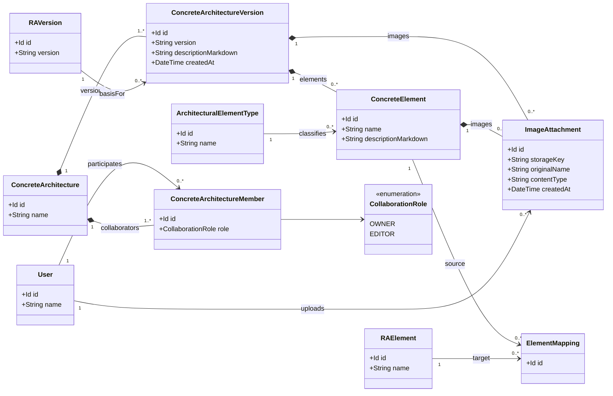

# 03-instanciacao-mapeamentos

```mermaid
classDiagram
    direction LR

    class User {
        +Id id
        +String name
    }

    class ConcreteArchitecture {
        +Id id
        +String name
    }

    class ConcreteArchitectureMember {
        +Id id
        +CollaborationRole role
    }

    class ConcreteArchitectureVersion {
        +Id id
        +String version
        +String descriptionMarkdown
        +DateTime createdAt
    }

    class RAVersion {
        +Id id
        +String version
    }

    class ConcreteElement {
        +Id id
        +String name
        +String descriptionMarkdown
    }

    class RAElement {
        +Id id
        +String name
    }

    class ArchitecturalElementType {
        +Id id
        +String name
    }

    class ElementMapping {
        +Id id
    }

    class ImageAttachment {
        +Id id
        +String storageKey
        +String originalName
        +String contentType
        +DateTime createdAt
    }

    class CollaborationRole {
        <<enumeration>>
        OWNER
        EDITOR
    }

    User "1" --> "0..*" ConcreteArchitectureMember : participates
    ConcreteArchitecture "1" *-- "1..*" ConcreteArchitectureMember : collaborators
    ConcreteArchitectureMember --> CollaborationRole

    ConcreteArchitecture "1" *-- "1..*" ConcreteArchitectureVersion : versions
    RAVersion "1" --> "0..*" ConcreteArchitectureVersion : basisFor

    ConcreteArchitectureVersion "1" *-- "0..*" ConcreteElement : elements
    ArchitecturalElementType "1" --> "0..*" ConcreteElement : classifies

    ConcreteElement "1" --> "0..*" ElementMapping : source
    RAElement "1" --> "0..*" ElementMapping : target

    ConcreteArchitectureVersion "1" *-- "0..*" ImageAttachment : images
    ConcreteElement "1" *-- "0..*" ImageAttachment : images
    User "1" --> "0..*" ImageAttachment : uploads
```
