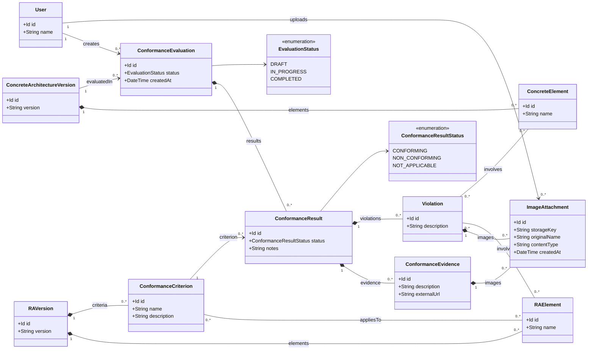

# 04-conformidade

```mermaid
classDiagram
    direction LR

    class User {
        +Id id
        +String name
    }

    class RAVersion {
        +Id id
        +String version
    }

    class RAElement {
        +Id id
        +String name
    }

    class ConcreteArchitectureVersion {
        +Id id
        +String version
    }

    class ConcreteElement {
        +Id id
        +String name
    }

    class ConformanceCriterion {
        +Id id
        +String name
        +String description
    }

    class ConformanceEvaluation {
        +Id id
        +EvaluationStatus status
        +DateTime createdAt
    }

    class ConformanceResult {
        +Id id
        +ConformanceResultStatus status
        +String notes
    }

    class ConformanceEvidence {
        +Id id
        +String description
        +String externalUrl
    }

    class Violation {
        +Id id
        +String description
    }

    class ImageAttachment {
        +Id id
        +String storageKey
        +String originalName
        +String contentType
        +DateTime createdAt
    }

    class EvaluationStatus {
        <<enumeration>>
        DRAFT
        IN_PROGRESS
        COMPLETED
    }

    class ConformanceResultStatus {
        <<enumeration>>
        CONFORMING
        NON_CONFORMING
        NOT_APPLICABLE
    }

    RAVersion "1" *-- "0..*" RAElement : elements
    RAVersion "1" *-- "0..*" ConformanceCriterion : criteria
    ConformanceCriterion "0..*" -- "0..*" RAElement : appliesTo

    ConcreteArchitectureVersion "1" *-- "0..*" ConcreteElement : elements
    ConcreteArchitectureVersion "1" --> "0..*" ConformanceEvaluation : evaluatedIn
    User "1" --> "0..*" ConformanceEvaluation : creates

    ConformanceEvaluation "1" *-- "0..*" ConformanceResult : results
    ConformanceCriterion "1" --> "0..*" ConformanceResult : criterion

    ConformanceResult "1" *-- "0..*" ConformanceEvidence : evidence
    ConformanceEvidence "1" *-- "0..*" ImageAttachment : images
    User "1" --> "0..*" ImageAttachment : uploads

    ConformanceResult "1" *-- "0..*" Violation : violations
    Violation "1" *-- "0..*" ImageAttachment : images
    Violation "0..*" -- "0..*" RAElement : involves
    Violation "0..*" -- "0..*" ConcreteElement : involves

    ConformanceEvaluation --> EvaluationStatus
    ConformanceResult --> ConformanceResultStatus
```
